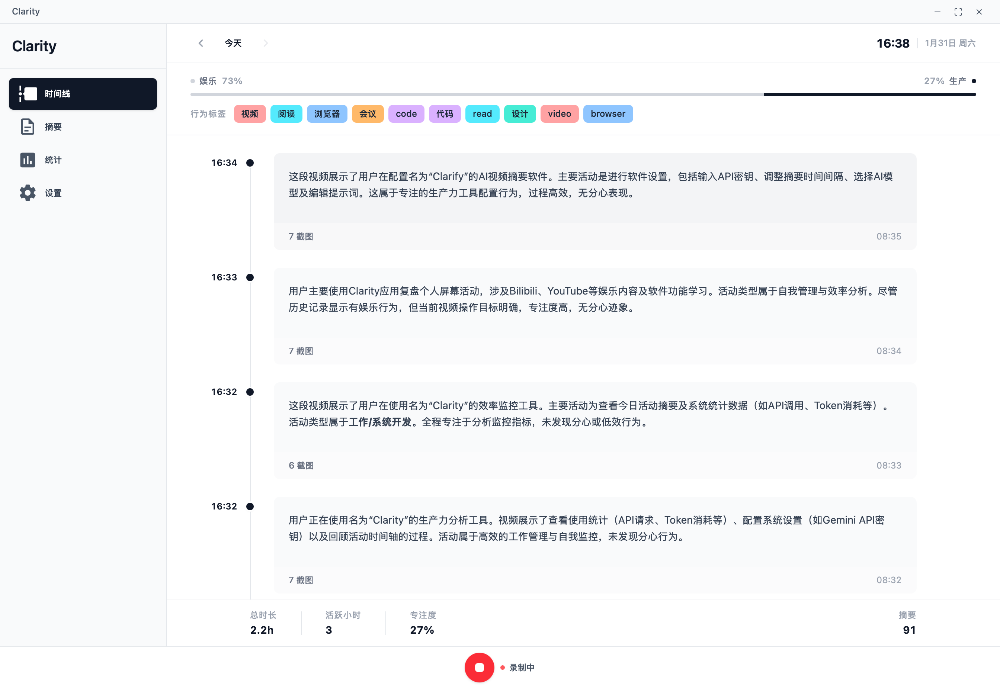

# Clarity

<div align="center">


**AI-powered productivity tracker that automatically captures your screen activity and provides intelligent insights. All data stays local for maximum privacy.**

[](https://opensource.org/licenses/MIT)
[](https://github.com/crapthings/clarity)
[](https://github.com/crapthings/clarity/releases)

[Features](#-features) • [Quick Start](#-quick-start) • [Documentation](#-documentation) • [Contributing](#-contributing) • [Support](#-support)

</div>

---

## ✨ Features

- **🎥 Automatic Screen Recording**: Captures screenshots at 1 FPS with minimal CPU usage
- **🤖 AI-Powered Analysis**: Uses Google Gemini API to generate intelligent activity summaries
- **📊 Rich Visualizations**: Beautiful charts and statistics for daily, weekly, monthly, and yearly insights
- **🌍 Multi-language Support**: Full support for English and Chinese (中文)
- **🔒 Privacy First**: All data is stored locally on your device - nothing leaves your computer
- **📈 Activity Timeline**: Visual timeline showing your daily activities with AI-generated summaries
- **⚡ High Performance**: Optimized screenshot capture and JPEG compression (quality 85)
- **🖥️ Cross-Platform**: Works on macOS, Windows, and Linux

## 🚀 Quick Start

### Prerequisites

- **Node.js** (v18 or higher) and **pnpm**
- **Rust** (latest stable) and **Cargo**
- **Tauri CLI v2**: `cargo install tauri-cli@^2`

### Installation

```bash
# Clone the repository
git clone https://github.com/crapthings/clarity.git
cd clarity

# Install dependencies
pnpm install

# Run in development mode
pnpm tauri dev

# Build for production
pnpm tauri build
```

### Platform-Specific Setup

#### macOS

The app requires **Screen Recording** permission. When you first run the app, macOS will prompt you to grant this permission. You can also grant it manually:

1. Open **System Settings** → **Privacy & Security** → **Screen Recording**
2. Enable **clarity**

#### Windows

The app may require administrator privileges for screen capture depending on your security settings.

#### Linux

On X11 systems, this typically works out of the box. On Wayland, you may need to grant permissions through your desktop environment's settings.

## 📖 Usage

1. **Start Recording**: Click the "Start Recording" button to begin capturing screenshots at 1 FPS
2. **View Timeline**: Navigate to the Trace page to see your activity timeline with AI-generated summaries
3. **Check Statistics**: Visit the Statistics page to see detailed metrics and API usage
4. **Generate Daily Summary**: Go to the Summary page to generate comprehensive daily reports with charts
5. **Configure Settings**: Set up your Google Gemini API key, adjust summary intervals, and customize AI prompts

### First-Time Setup

1. Get a Google Gemini API key from [Google AI Studio](https://aistudio.google.com/app/apikey)
2. Open Settings and paste your API key
3. Configure your preferred AI model (default: `gemini-3-flash-preview`)
4. Customize the AI prompt for summaries (supports both English and Chinese)
5. Set your preferred language and video resolution

## 🏗️ Architecture

Clarity is built with modern web technologies:

- **Frontend**: React 19 + Vite + TailwindCSS + BaseUI
- **Backend**: Rust + Tauri v2
- **Database**: SQLite (local storage)
- **AI**: Google Gemini API (File API for video processing)
- **Charts**: Recharts for data visualization

### Project Structure

```
clarity/
├── src/                    # React frontend
│   ├── components/         # React components
│   ├── pages/             # Page components (Trace, Summary, Statistics, Settings)
│   ├── i18n/              # Internationalization
│   └── store.js           # Zustand state management
├── src-tauri/             # Rust backend
│   ├── src/
│   │   ├── lib.rs         # Main application logic
│   │   ├── db.rs          # Database operations
│   │   └── video_summary.rs # Video processing and AI integration
│   └── Cargo.toml         # Rust dependencies
└── package.json           # Node.js dependencies
```

## 🔧 Configuration

### AI Settings

- **API Key**: Your Google Gemini API key (required for AI summaries)
- **Model**: AI model to use (default: `gemini-3-flash-preview`)
- **Summary Interval**: How often to generate summaries (default: 45 seconds)
- **Video Resolution**: Low (~100 tokens/sec) or Default (~300 tokens/sec) for better text recognition
- **Custom Prompts**: Customize AI prompts in both English and Chinese

### Storage

Screenshots are automatically stored in platform-specific directories:

- **macOS**: `~/Library/Application Support/clarity/recordings/`
- **Windows**: `%LOCALAPPDATA%/clarity/recordings/`
- **Linux**: `~/.local/share/clarity/recordings/`

All data is organized by date (YYYY-MM-DD) for easy browsing.

## 📚 Documentation

- [Contributing Guide](CONTRIBUTING.md) - How to contribute to Clarity
- [Code of Conduct](CODE_OF_CONDUCT.md) - Community guidelines
- [Security Policy](SECURITY.md) - Security and privacy information
- [Privacy Policy](docs/PRIVACY.md) - Detailed privacy information
- [Architecture](docs/ARCHITECTURE.md) - System architecture and design
- [API Documentation](docs/API.md) - Tauri commands reference
- [Changelog](CHANGELOG.md) - Version history

## 🤝 Contributing

We welcome contributions! Please see our [Contributing Guide](CONTRIBUTING.md) for details.

1. Fork the repository
2. Create your feature branch (`git checkout -b feature/amazing-feature`)
3. Commit your changes (`git commit -m 'Add some amazing feature'`)
4. Push to the branch (`git push origin feature/amazing-feature`)
5. Open a Pull Request

## 📝 License

This project is licensed under the MIT License - see the [LICENSE](LICENSE) file for details.

## 💝 Support

If you find Clarity useful, please consider:

- ⭐ **Starring** this repository
- 🐛 **Reporting bugs** via [GitHub Issues](https://github.com/crapthings/clarity/issues)
- 💡 **Suggesting features** via [GitHub Discussions](https://github.com/crapthings/clarity/discussions)
- 💰 **Sponsoring** the project via [GitHub Sponsors](https://github.com/sponsors/crapthings)

## 🙏 Acknowledgments

- Inspired by [Dayflow](https://dayflow.app/) concepts
- Built with [Tauri](https://tauri.app/) - a framework for building desktop applications
- AI powered by [Google Gemini](https://ai.google.dev/)

## 📸 Screenshots

<div align="center">



*Clarity - AI-Powered Productivity Tracker*

</div>

---

<div align="center">

Made with ❤️ by [crapthings](https://github.com/crapthings)

[Report Bug](https://github.com/crapthings/clarity/issues) • [Request Feature](https://github.com/crapthings/clarity/issues) • [Documentation](https://github.com/crapthings/clarity#readme)

</div>
